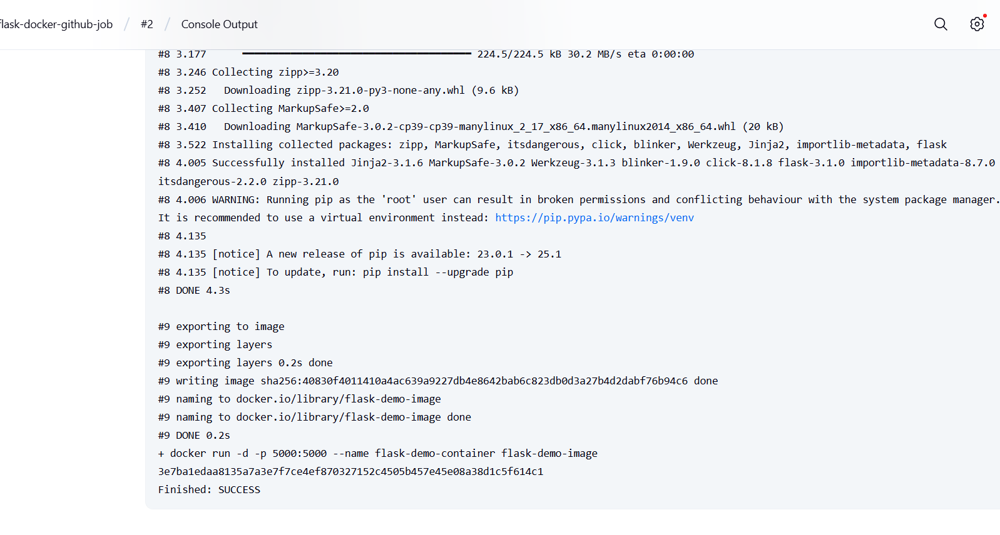
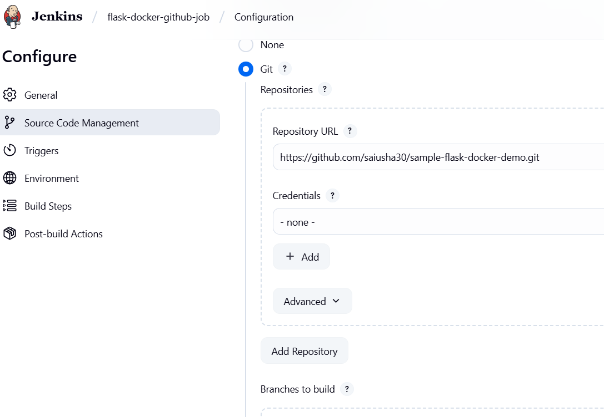
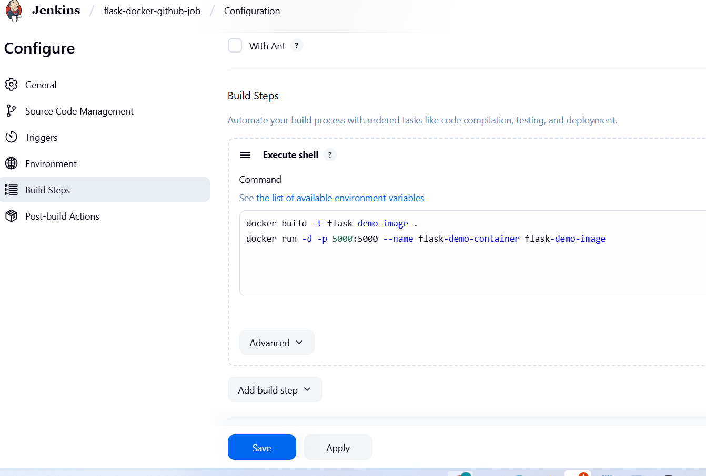

#  Sample Flask App with Docker and Jenkins

## 📌 Description
This project shows how to run a Flask app using Docker and build it using Jenkins.

## 🛠️ Setup Instructions
##project Folder

my-docker-project/
│── app.py           # Flask application
│── requirements.txt # Dependencies
│── Dockerfile       # Docker setup
│── .gitignore       # Ignore unnecessary files
│── README.md        # Project documentation
└── static/          # (Optional: for static files)
`images/` – Folder for screenshots

## prerequests
* install docker
* install git
* install jenkins with java 17
## 🐳 Docker Steps

### Build Image
```bash
docker build -t flask-demo-image .

Run Container
docker run -d -p 5000:5000 --name flask-demo-container flask-demo-image
Open in Browser
Go to: http://<your-EC2-IP>:5000

🤖 Jenkins Freestyle Job
1. Create a Freestyle job
2. Use Git repo:
https://github.com/saiusha30/sample-flask-docker-demo.git
3. Add build steps:
docker build -t flask-demo-image .
docker run -d -p 5000:5000 --name flask-demo-container flask-demo-image
4.Click Build Now

📸 Screenshots

### Jenkins Job Success Screenshot


### 🛠️ Jenkins Job Configuration
This screenshot shows the configuration of the Jenkins job used to build the Flask Docker app.




### 🌐 Flask App Running on Browser
This screenshot shows the Flask application running successfully on port 5000 in the browser.


🔄 Useful Commands

docker ps -a          # See containers
docker images         # See images
docker stop <id>      # Stop container
docker rm <id>        # Remove container
docker rmi <id>       # Remove image

✅ Author
GitHub: saiusha30


